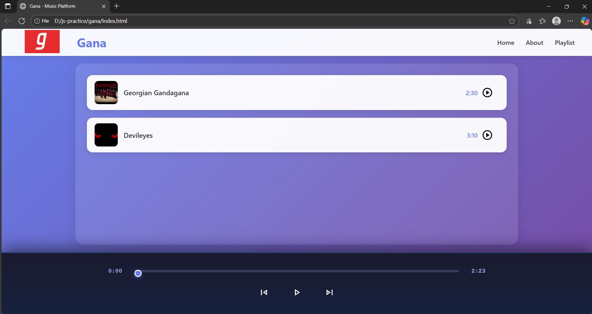

# 🎵 Gana Music Player

## 📖 Overview

**Gana Music Player** is a web-based music player built using **HTML**, **CSS**, and **JavaScript**.  
It provides smooth audio playback, a visual progress bar, and a modern, responsive interface — all without external dependencies.

---

## 📁 Project Structure

gana/
├── Index.html # Main interface
├── Home.html # Secondary page
├── style.css # Styling and layout
├── script.js # Audio player logic
├── server.js # Node.js static server (optional)
├── package.json # Project metadata
├── Gandagana.mp3 # Sample track 1
├── DevilEyes.mp3 # Sample track 2
├── gandaganacover.jpg # Cover 1
├── devileyescover.jpg # Cover 2
├── logo.png # Navbar logo
├── play.svg # Play icon
├── pause.svg # Pause icon
├── next.svg # Next button
├── previous.svg # Previous button
└── [other UI icons] # Additional interface assets


---

## 🚀 Features

- 🎧 **Play / Pause / Next / Previous** music controls  
- 🕒 **Live progress bar** updates as the song plays  
- 💽 **Seekable progress bar** (click & drag to navigate)  
- 📀 **Auto-play next track** after current ends  
- 💡 **Responsive layout** and modern UI  
- 🖥️ Works locally with or without Node.js static server  

---

## 🧠 Tech Stack

| Layer             | Technologies |
|------------------|---------------|
| **Frontend**      | HTML, CSS, JavaScript (Audio API) |
| **Backend / Server** | Node.js (built-in `http` module) |
| **Runtime**       | Node.js v18+ (no frameworks or dependencies) |

---

## 🗂️ How It Works

- `script.js` handles all player functionality using the **HTML5 Audio API**  
- **Master Play/Pause button** toggles icons (`play.svg` ↔ `pause.svg`)  
- **Next / Previous buttons** cycle between songs  
- **Progress bar (`#myprogressbar`)** syncs with playback and allows scrubbing  
- Clicking a **song item** loads and plays that track instantly  

---

## 🖌️ User Interface

- **Navbar:** Logo, title “Gana”, and navigation links (Home, About, Playlist)  
- **Main Container:** Displays songs with album art, titles, and individual play buttons  
- **Bottom Bar:** Persistent audio controls with progress slider  

---

## 🎯 Key Highlights

- ✅ Clean, modern UI with a black & pink theme  
- ✅ Smooth playback with real-time progress tracking  
- ✅ Fully functional on desktop and mobile  
- ✅ No external dependencies — lightweight and fast  
- ✅ Easy to extend (add more songs or features)  

---

## 🚀 How to Run

### Option 1: Direct Open
Open `Index.html` in any modern browser.

### Option 2: Node.js Server
```bash
## 👀 Preview


